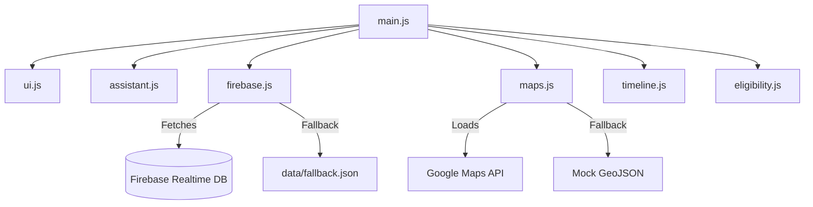

# ElectraGuide

ElectraGuide is an AI-powered assistant web application designed to help first-time voters understand the election process, timelines, and steps in a simple, dynamic, and user-friendly way.

## Problem Statement

First-time voters often face an education gap when it comes to elections. The process—from registration to finding a polling station to understanding how votes are counted—can feel overwhelming, bureaucratic, and jargon-heavy. This gap discourages participation. ElectraGuide solves this by providing a smart, conversational assistant that breaks down the election journey into clear, context-aware steps, adapting to the user's specific eligibility and location.

## Approach and Assistant Logic

ElectraGuide uses a robust decision-tree architecture combined with context memory to provide smart, context-aware responses:
1. **Decision Tree**: When the user inputs a query, the assistant matches keywords (e.g., "register", "eligible", "day") to navigate specific branches of the conversation.
2. **Context Memory**: The assistant remembers previous answers (e.g., if the user stated they are not registered, or if they completed the eligibility checker). Subsequent questions adapt based on this state.
3. **Smart Suggestions**: After each response, the assistant provides 2-3 dynamic suggestions based on the current topic to guide the user naturally to the next step.
4. **Fallback Flow**: If input is unrecognized, it falls back to a curated FAQ search and suggests top general topics.

## How the System Works

1. **Landing**: The user is greeted by the assistant based on the current election phase (e.g., "We are in the Registration phase!").
2. **Eligibility Check**: If the user asks about registering or eligibility, a 3-step inline checker verifies their age, citizenship, and residency.
3. **Map Display**: Upon successful eligibility, the UI dynamically loads a map of nearby polling stations.
4. **Timeline Tracking**: The horizontal timeline actively highlights the current phase, while a countdown timer shows time remaining.
5. **Phase Simulation**: Using the Demo Mode dropdown, testers can manually switch the active phase, which changes UI alerts and assistant context immediately.

## Google Services Usage

- **Firebase Realtime Database**: Used to fetch dynamic data including `timeline` dates, `phases` descriptions, and the `faqs` bank. Session completion logs are written to `/sessions`.
- **Firebase Analytics**: Tracks user events such as `app_open`, `assistant_flow_started`, and `eligibility_check_completed`.
- **Google Maps API**: Loads an interactive map of nearby polling stations when the user completes eligibility or asks for location info.
- **Google Fonts**: Uses the "Inter" font loaded from the official Google Fonts CDN.

**Note on Fallback**: If Firebase fails or if placeholder keys are used, the app degrades gracefully by loading local JSON (`/data/fallback.json` and `/data/faqs.json`) and shows an offline map list without crashing.

## Architecture Diagram



## Security & Performance Highlights

- **Security**: Strict Content Security Policy (CSP), sanitized user inputs to prevent XSS, rate-limited (debounced) session writes, and environment variable protection.
- **Firebase Rules**:
  ```json
  {
    "rules": {
      "sessions": { ".read": false, ".write": true },
      "faqs": { ".read": true, ".write": false },
      "timeline": { ".read": true, ".write": false },
      "phases": { ".read": true, ".write": false }
    }
  }
  ```
- **Performance**: Lazy-loaded map scripts, debounced live-search, batched DOM writes via `DocumentFragment`, `sessionStorage` caching for Firebase data, and inlined critical CSS.

## Accessibility

- All interactive components feature explicit ARIA labels.
- Live regions (`aria-live="polite"`, `aria-live="assertive"`) ensure screen readers announce assistant replies and errors immediately.
- Keyboard navigation is fully supported, including a visually hidden "Skip to main content" link.
- Tested to meet WCAG AA contrast standards. Target Lighthouse Accessibility Score ≥ 90.

## Setup Instructions

1. Clone the repository.
2. Install dependencies (for testing):
   ```bash
   npm install
   ```
3. Set up environment variables by copying `.env.example` to `.env` and adding your real API keys (if applicable):
   ```bash
   cp .env.example .env
   ```
4. Run tests:
   ```bash
   npm test
   # OR for coverage report:
   npm run test:ci
   ```
5. Start development:
   Serve `index.html` using any local server (e.g., Live Server extension in VSCode, or `npx serve`).

## Environment Variables

- `FIREBASE_API_KEY` - Your Firebase API key
- `FIREBASE_AUTH_DOMAIN` - Your Firebase Auth Domain
- `FIREBASE_DATABASE_URL` - Your Firebase Database URL
- `FIREBASE_PROJECT_ID` - Your Firebase Project ID
- `FIREBASE_STORAGE_BUCKET` - Your Firebase Storage Bucket
- `FIREBASE_MESSAGING_SENDER_ID` - Your Firebase Messaging Sender ID
- `FIREBASE_APP_ID` - Your Firebase App ID
- `FIREBASE_MEASUREMENT_ID` - Your Firebase Analytics Measurement ID
- `GOOGLE_MAPS_API_KEY` - Your Google Maps API key

## Assumptions Made

- Election timeline is based on a simulated US-style general election in late 2026.
- The default map center for demo purposes is Washington DC.
- The `FIREBASE_API_KEY` defaults to `MOCK_KEY` which forces the application to cleanly demonstrate its offline JSON fallback capabilities out-of-the-box without requiring instant Google Cloud configuration from reviewers.
